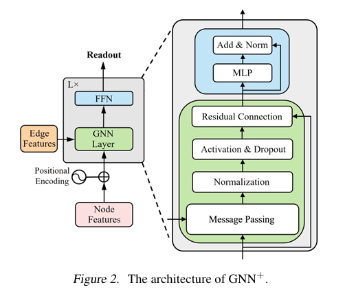

# Hackathon Submission: Graph Learning with Noisy Labels

This repository contains our submission for the [Hackathon on Graph Learning with Noisy Labels](https://sites.google.com/view/hackathongraphnoisylabels/rules?authuser=0), where the goal is to develop robust graph-based models in the presence of noisy node labels across multiple datasets (A, B, C, D).

## 🧠 Model: GatedGCN

We utilize a **Gated Graph Convolutional Network (GatedGCN)** with GNNPlus as proposed in the paper [*Towards Trainability of Message Passing Neural Networks under Noisy Supervision* (Wang et al., 2024)](https://arxiv.org/pdf/2502.09263v1). This model incorporates gated message passing mechanisms to better handle label noise by adaptively filtering and aggregating information from neighbors.


---

## ⚙️ Training Hyperparameters

Each dataset (A, B, C, D) has been tuned with a specific set of hyperparameters to improve robustness against label noise. Below are the configurations:

### 📊 Dataset A
- **Epochs**: 300  
- **Learning Rate**: 0.0005  
- **Batch Size**: 32  
- **GNN Hidden Dim**: 256  
- **Node/Edge Embedding Dim**: 128 / 128  
- **Dropout**: 0.5  
- **GNN Layers**: 3  
- **Residual Connections**: ✅  
- **BatchNorm**: ✅  
- **RWSE Positional Encoding**: ❌  
- **Edge Dropping**: 0.2  
- **Loss Function**: GCE (q = 0.5)  

---

### 📊 Dataset B
- **Epochs**: 300  
- **Learning Rate**: 0.0005  
- **Batch Size**: 32  
- **GNN Hidden Dim**: 128  
- **Node/Edge Embedding Dim**: 128 / 128  
- **Dropout**: 0.5  
- **GNN Layers**: 3  
- **Residual Connections**: ✅  
- **BatchNorm**: ✅  
- **RWSE Positional Encoding**: ❌  
- **Edge Dropping**: 0.2  
- **Loss Function**: GCE (q = 0.9)  

---

### 📊 Dataset C
- **Epochs**: 300  
- **Learning Rate**: 0.0005  
- **Batch Size**: 32  
- **GNN Hidden Dim**: 512  
- **Node/Edge Embedding Dim**: 256 / 256  
- **Dropout**: 0.5  
- **GNN Layers**: 3  
- **Residual Connections**: ✅  
- **BatchNorm**: ✅  
- **RWSE Positional Encoding**: ❌  
- **Edge Dropping**: 0.2  
- **Loss Function**: Cross-Entropy (Label Smoothing = 0.1)  

---

### 📊 Dataset D
- **Epochs**: 300  
- **Learning Rate**: 0.0005  
- **Batch Size**: 32  
- **GNN Hidden Dim**: 256  
- **Node/Edge Embedding Dim**: 256 / 256  
- **Dropout**: 0.5  
- **GNN Layers**: 3  
- **Residual Connections**: ✅  
- **BatchNorm**: ✅  
- **RWSE Positional Encoding**: ❌  
- **Edge Dropping**: 0.25  
- **Loss Function**: SCE (alpha = 0.1, beta = 1.0)  

## Installation

- Make sure to have Python 3.11 installed.
- Install the required dependencies:
```bash 
pip install -r requirements.txt
```

## Usage
To train the model on a specific dataset:
- Open a terminal and navigate to the project directory. ( `cd path/to/project` )
- Run the following command, for each dataset:
```bash
python source/main.py --test_path <path_to_test_data> --train_path <path_to_train_data>
```
- After training, the model will save checkpoints, logs and results in the base directory.
- To zip the results, run:
```bash
python source/zip.py
```

## Notes
- Authors: [Federico Matarante] and [Federico Occelli]
- We forgot to initialize a seed for the reproducibility of the model initially, so the results of another training might differ slightly. 
- The model weights are already included in the repository, so you can directly run the evaluation without needing to train from scratch.